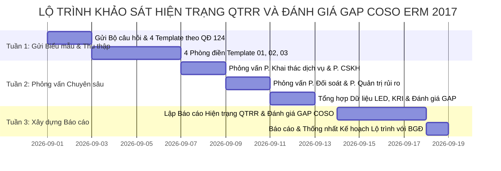

# BỘ CÂU HỎI PHỎNG VẤN VÀ TEMPLATE THU THẬP THÔNG TIN DỰ ÁN ERM
**(CẬP NHẬT THEO QUYẾT ĐỊNH 124/QĐ-VDS VỀ CHỨC NĂNG NHIỆM VỤ CHI TIẾT)**

**Đơn vị thí điểm:** Trung tâm Vận hành Khai thác (VHKT) – Viettel Digital Services (VDS)  
**Căn cứ pháp lý:** Quyết định số 124/QĐ-VDS ban hành ngày 23/06/2026 về Quy định Chức năng nhiệm vụ Mô hình tổ chức chi tiết VDS  
**Khung tham chiếu:** COSO ERM 2017 Framework (5 thành phần, 20 nguyên tắc)  
**Phạm vi:** 04 Phòng trực thuộc Trung tâm VHKT (Phòng Khai thác dịch vụ; Phòng Chăm sóc khách hàng; Phòng Đối soát; Phòng Quản trị rủi ro)

---

## MỤC TIÊU VÀ CẤU TRÚC TÀI LIỆU

Tài liệu này được cập nhật chính xác theo **chức năng, nhiệm vụ quy định tại QĐ 124/QĐ-VDS** cho 04 Phòng chuyên trách thuộc Trung tâm VHKT nhằm thực hiện 3 mục tiêu:
1. **Xác định, thu thập quy trình nghiệp vụ trọng yếu & loại dữ liệu tổn thất (Loss Data).**
2. **Xác định các chỉ số (KRI), công cụ theo dõi rủi ro và quản lý sự cố tại các đơn vị.**
3. **Khảo sát cách thức quản trị, nhận thức & văn hóa QTRR tại các đơn vị (Đánh giá GAP so với COSO ERM 2017).**

---

# PHẦN 1: BỘ CÂU HỎI PHỎNG VẤN CHUYÊN SÂU (INTERVIEW QUESTIONNAIRE)

---

## I. KHỐI CÂU HỎI CHUNG (DÙNG CHO BẰNG NĂNG LỰC QUẢN TRỊ & VĂN HÓA COSO ERM 2017)

### 1. Nhận thức, Văn hóa & Cơ cấu Quản trị (COSO 1: Governance & Culture)
* **Q1.1:** Anh/Chị hiểu thế nào về vai trò của Quản trị rủi ro (QTRR) trong việc đảm bảo dịch vụ vận hành ổn định, an toàn, liên tục và bảo vệ doanh thu theo chức năng của Trung tâm VHKT?
* **Q1.2:** Việc phân định trách nhiệm QTRR (Tuyến 1 - Phòng nghiệp vụ vs Tuyến 2 - Phòng QTRR) theo QĐ 124/QĐ-VDS đã được cụ thể hóa trong Mô tả công việc (JD) của từng chuyên viên chưa?
* **Q1.3:** Văn hóa báo cáo sự cố/lỗi vận hành tại đơn vị hiện nay ra sao? Cán bộ nhân viên có chủ động báo cáo rủi ro/lỗi đơn lẻ ngay khi phát hiện hay có tâm lý e ngại bị kỷ luật?

### 2. Chiến lược & Khả năng Chấp nhận Rủi ro (COSO 2: Strategy & Objective-Setting)
* **Q2.1:** Các chỉ tiêu KPI/OKRs của Phòng (như Uptime hệ thống, SLA xử lý tra soát, tỷ lệ lệch đối soát, tỷ lệ giải đáp CSKH) được gắn kết với mục tiêu quản trị rủi ro của VDS như thế nào?
* **Q2.2:** Đơn vị đã có quy định rõ ràng về "Mức độ chấp nhận rủi ro" (Risk Appetite/Tolerance) cho từng mảng nghiệp vụ chưa (Ví dụ: Thời gian sập dịch vụ tối đa cho phép, giá trị lệch đối soát tối đa chấp nhận được, SLA xử lý sự cố P1/P2...)?

### 3. Nhận diện Rủi ro & Quản lý Dữ liệu Tổn thất (COSO 3: Performance - Risk & Loss Data)
* **Q3.1:** Dựa trên chức năng nhiệm vụ tại QĐ 124, những quy trình nào tại Phòng được đánh giá là chứa đựng rủi ro vận hành/tài chính/ATTT cao nhất?
* **Q3.2:** Đơn vị ghi nhận và quản lý dữ liệu sự cố/tổn thất (Loss Event Database - LED) ra sao? Các chi phí phát sinh (bồi thường khách hàng, phạt hợp đồng đối tác, tổn thất do lệch tiền không thu hồi được, chi phí xử lý sự cố CNTT) có được thống kê đầy đủ không?

### 4. Chỉ số Cảnh báo Rủi ro (KRI) & Công cụ Giám sát (COSO 3 & 5: Monitoring & Tools)
* **Q4.1:** Những chỉ số rủi ro trọng yếu (KRI) nào đang được phòng sử dụng để cảnh báo sớm rủi ro vận hành (Ví dụ: Tỷ lệ mất đồng bộ luồng giao dịch, tải TPS/CCU cận ngưỡng, tỷ lệ ticket quá hạn SLA, số dư lệch đối soát quá 24h...)?
* **Q4.2:** Các hệ thống/công cụ phần mềm nào đang trực tiếp hỗ trợ phòng trong việc giám sát, cảnh báo và đo lường rủi ro (Grafana, Zabbix, CRM, Tool Đối soát, Dashboard tự động...)?

---

## II. BỘ CÂU HỎI ĐẶC THÙ THEO CHỨC NĂNG NHIỆM VỤ THEO QĐ 124/QĐ-VDS

### 1. PHÒNG KHAI THÁC DỊCH VỤ (P. KTDV)
*(Căn cứ Mục 3.3.a - QĐ 124/QĐ-VDS: Giám sát & tác động dịch vụ, Quản lý dịch vụ, Hạ tầng & tích hợp dịch vụ)*

* **Mảng Giám sát & Tác động Dịch vụ:**
  * **Q-KT.1:** Quy trình giám sát và điều hành xử lý lỗi bước 1 (bật/tắt cờ dịch vụ, restart hệ thống...) theo kịch bản tác động được phê duyệt bởi BO hiện được kiểm soát rủi ro ra sao để tránh tác động nhầm gây gián đoạn dịch vụ?
  * **Q-KT.2:** Mức độ tự động hóa các công cụ giám sát cảnh báo và tác động sự cố hiện tại đạt bao nhiêu %? Các bài toán tự động hóa giám sát đang gặp khó khăn gì?
* **Mảng Quản lý Dịch vụ (Service Management):**
  * **Q-KT.3 (Quản lý thay đổi & Golive):** Việc phối hợp UAT, tiếp nhận tài liệu luồng xử lý nghiệp vụ sản phẩm và đánh giá chéo QA với các Trung tâm Kinh doanh trước khi Go-live dịch vụ có phát hiện triệt để các rủi ro kỹ thuật/nghiệp vụ không?
  * **Q-KT.4 (Quản lý vấn đề & Lập PYC):** Quy trình phân tích nguyên nhân gốc rễ phản ánh khách hàng và **viết PYC (Phiếu yêu cầu thay đổi)** gửi sang Khối Kinh doanh để khắc phục lỗi nghiệp vụ/hệ thống có được theo dõi tiến độ triệt để không? Có tình trạng PYC bị tồn đọng kéo dài không?
  * **Q-KT.5 (Quản lý dung lượng & TPS/CCU):** Khi Khối Kinh doanh tung sản phẩm/chính sách mới, việc đánh giá tài nguyên hệ thống có đáp ứng được **tải TPS (Transactions Per Second) và CCU (Concurrent Users)** được thực hiện ra sao để ngăn ngừa sự cố quá tải?
  * **Q-KT.6 (Đánh giá hiệu quả & SLA đối tác):** Định kỳ tuần/tháng, phòng kiểm soát và đánh giá hiệu quả sử dụng hệ thống, hiệu quả kết nối dịch vụ cũng như đánh giá tuân thủ SLA của các đơn vị đối tác bên ngoài (VTNet, IDC, Ngân hàng...) như thế nào?
* **Mảng Hạ tầng & Tích hợp Dịch vụ:**
  * **Q-KT.7:** Quy trình thẩm định sizing hạ tầng máy chủ, database (Oracle, MariaDB, NoSQL) và Cloud K8s có dự phòng được rủi ro tăng trưởng đột biến không? Checklist đánh giá tiêu chuẩn ứng dụng/hạ tầng theo chuẩn Tập đoàn đã được áp dụng 100% chưa?

---

### 2. PHÒNG CHĂM SÓC KHÁCH HÀNG (P. CSKH)
*(Căn cứ Mục 3.3.b - QĐ 124/QĐ-VDS: CSKH trước/trong/sau bán, Tra soát - Tranh chấp, Phân tích & gคำ giữ KH, Điều hành toàn trình sự cố VDS, Đảm bảo chất lượng đa kênh, Hỗ trợ kênh bán & đối tác)*

* **Mảng CSKH trước/trong/sau bán & Tra cứu:**
  * **Q-CS.1:** Việc quy hoạch toàn trình nghiệp vụ hỗ trợ và tài liệu/chức năng tra cứu trước khi triển khai dịch vụ mới đến khách hàng có đảm bảo đầy đủ từ phía Khối Kinh doanh/Sản phẩm không?
* **Mảng Tra soát - Giải quyết - Tranh chấp & Báo cáo Cơ quan Quản lý:**
  * **Q-CS.2:** Quy trình tiếp nhận và xử lý các yêu cầu tra soát/tranh chấp từ **Ngân hàng Nhà nước (NHNN), Bộ/Ban/Ngành** và giải quyết các khiếu nại khó/chuyên sâu (liên quan đến mất tiền, lừa đảo, rò rỉ thông tin) được thực hiện thế nào để tránh khủng hoảng truyền thông?
  * **Q-CS.3:** Việc lập và gửi **Báo cáo định kỳ về công tác tra soát/giải quyết tranh chấp đến NHNN/Bộ/Ban/Ngành** theo giấy phép kinh doanh được kiểm soát tính chính xác và tuân thủ thời hạn ra sao?
* **Mảng Phân tích & Gìn giữ Khách hàng (Chăm sóc chủ động):**
  * **Q-CS.4:** Phòng sử dụng phương pháp nào để phân tích **"các điểm đứt gãy sản phẩm"** từ dữ liệu khiếu nại của khách hàng nhằm đề xuất Khối Kinh doanh cải tiến chính sách/quy trình?
* **Mảng Điều hành Toàn trình Sự cố VDS:**
  * **Q-CS.5:** Căn cứ vào cảnh báo dịch vụ và phản ánh KH, quy trình **kích hoạt và điều hành toàn trình sự cố VDS** (định hướng ứng xử với KH, đánh giá mức độ ảnh hưởng) được phối hợp với P. Khai thác dịch vụ & P. QTRR ra sao?
* **Mảng Hỗ trợ Kênh bán, Đối tác & Merchant chi lương:**
  * **Q-CS.6:** Đơn vị thực hiện phân tích giao dịch lỗi của **merchant/đối tác đặc thù (chi lương, học phí...)** để chủ động chăm sóc và đề xuất thay đổi luồng phối hợp như thế nào?

---

### 3. PHÒNG ĐỐI SOÁT (P. ĐỐI SOÁT)
*(Căn cứ Mục 3.3.c - QĐ 124/QĐ-VDS: Đối soát & xác nhận số liệu phân chia doanh thu/chi phí, Kiểm soát giao dịch bất thường & đảm bảo doanh thu, Quản lý toàn trình quy trình phối hợp)*

* **Mảng Đối soát & Xác nhận Số liệu Thanh toán:**
  * **Q-DS.1:** Quy trình đối soát số liệu phát sinh trên các hệ thống CNTT VDS với đối tác (Ngân hàng, Telco, Merchant, Ví điện tử) để làm cơ sở thanh toán, **phân chia doanh thu, chi phí** theo hợp đồng được thực hiện với tần suất nào? Tỷ lệ khớp tự động (Auto-matching) là bao nhiêu?
  * **Q-DS.2:** Rủi ro đối soát chậm tiến độ hoặc sai lệch số liệu thanh toán phân chia doanh thu/chi phí với đối tác xử lý ra sao? Quy trình phê duyệt biên bản đối soát và số liệu thanh toán được kiểm soát 2 cấp thế nào?
* **Mảng Kiểm soát Giao dịch Bất thường & Đảm bảo Doanh thu:**
  * **Q-DS.3:** Phòng đang triển khai các phương án nào để **kiểm soát chi tiết giao dịch, kiểm soát mất đồng bộ, kiểm soát luồng giao dịch** nhằm phát hiện kịp thời các sai lệch dẫn đến tổn thất doanh thu hoặc lỗi dịch vụ cho khách hàng?
  * **Q-DS.4:** Khi phát hiện giao dịch bất thường hoặc mất đồng bộ luồng tiền (Ví dụ: Core Ví ghi nhận thành công nhưng Gateway Ngân hàng báo thất bại hoặc ngược lại), quy trình cảnh báo tức thời và chặn tổn thất tài chính được kích hoạt như thế nào?
* **Mảng Quản lý toàn trình & Ban hành Quy trình Phối hợp:**
  * **Q-DS.5:** Việc ban hành và rà soát các quy trình phối hợp xử lý sai lệch/lệch tiền giữa P. Đối soát với P. CSKH, P. Khai thác dịch vụ và các Khối Kinh doanh có gặp vướng mắc hay điểm nghẽn nào không? Trách nhiệm đền bù tài chính khi xảy ra thất thoát tiền được quy định cụ thể chưa?

---

### 4. PHÒNG QUẢN TRỊ RỦI RO (P. QTRR)
*(Căn cứ Mục 3.3.d - QĐ 124/QĐ-VDS: Ban hành chính sách/công cụ QTRR, Triển khai QTRR vận hành, Giám sát rủi ro công nghệ, hệ thống & ATTT, Giám sát tuân thủ quy trình/tiêu chuẩn)*

* **Xây dựng Chính sách & Hệ thống QTRR:**
  * **Q-RR.1:** Khung QTRR Vận hành và các quy định/hướng dẫn nhận diện, đo lường, kiểm soát rủi ro cho Trung tâm VHKT đã được ban hành đầy đủ và cập nhật theo COSO ERM 2017 chưa?
* **Triển khai Quản trị Rủi ro Vận hành (Operational Risk Management):**
  * **Q-RR.2:** Phương pháp thu thập và quản lý **Cơ sở dữ liệu Tổn thất (Loss Event Database - LED)** toàn Trung tâm từ 3 phòng (P. KTDV, P. CSKH, P. Đối soát) đang được thực hiện thủ công hay tự động? Làm sao đảm bảo các phòng không "giấu" sự cố/tổn thất?
  * **Q-RR.3:** Việc lập Bảng đồ Rủi ro (Risk Heatmap) và theo dõi các Chỉ số Rủi ro Trọng yếu (KRI) của Trung tâm VHKT được thực hiện với tần suất nào?
* **Giám sát Rủi ro Công nghệ, Hệ thống & ATTT Vận hành:**
  * **Q-RR.4:** Phòng QTRR phối hợp với P. Khai thác dịch vụ và Bộ phận ATTT (thuộc P. CNTT) như thế nào trong việc giám sát rủi ro ATTT công nghệ, rủi ro ATTT hệ thống và rủi ro sập dịch vụ trong quá trình vận hành?
  * **Q-RR.5:** Quy trình giám sát việc tuân thủ các quy trình, quy định, tiêu chuẩn chất lượng (ISO 27001, ISO 9001, SLA) của CBNV thuộc Trung tâm VHKT được triển khai và báo cáo định kỳ ra sao?

---

# PHẦN 2: BỘ TEMPLATE THU THẬP THÔNG TIN (DATA COLLECTION TEMPLATES)

---

## TEMPLATE 01: DANH MỤC QUY TRÌNH NGHIỆP VỤ TRỌNG YẾU & ĐIỂM RỦI RO
*(Chuẩn hóa theo chức năng nhiệm vụ QĐ 124/QĐ-VDS)*

| STT | Mã Quy trình | Tên Quy trình Nghiệp vụ | Phòng ban Chủ trì | Mức độ Trọng yếu | Các bước chính | Rủi ro tiềm ẩn (Risk Events) | Nguyên nhân gốc rễ (Root Causes) | Tác động (Tài chính/ Vận hành/ Uy tín/ Pháp lý) | Biện pháp kiểm soát hiện hữu | Đánh giá Hiệu quả Kiểm soát |
|:---:|:------------:|:------------------------|:-----------------:|:----------------:|:---------------|:-----------------------------|:---------------------------------|:------------------------------------------------|:-----------------------------|:---------------------------|
| 1 | QT-DS-01 | Đối soát & phân chia doanh thu/chi phí đối tác | P. Đối soát | **High** | 1. Lấy file kê đối tác 2. Chạy tool matching 3. Xác nhận số liệu thanh toán | Sai lệch số liệu phân chia doanh thu; Chậm thanh toán hợp đồng | File kê đối tác sai định dạng; Lỗi hệ thống truyền nhận file FTP | Tổn thất tài chính; Bị đối tác phạt hợp đồng | Kiểm soát 2 cấp số liệu đối soát + Tool matching tự động | Đạt |
| 2 | QT-DS-02 | Kiểm soát giao dịch mất đồng bộ luồng tiền | P. Đối soát | **High** | 1. Chạy query quét lệch 2. Cảnh báo kênh 3. Xử lý tra soát | Tiền ra khỏi tài khoản KH nhưng không tới Ngân hàng; Thất thoát quỹ | Lỗi Gateway kết nối Ngân hàng; Lỗi timeout luồng thanh toán | Thất thoát tài chính nghiêm trọng; KH khiếu nại | Script SQL kiểm tra định kỳ hàng giờ + Cảnh báo Email | Yếu (Do chạy thủ công SQL, chưa real-time) |
| 3 | QT-CS-01 | Xử lý tra soát & báo cáo tranh chấp NHNN/Bộ ngành | P. CSKH | **High** | 1. Tiếp nhận công văn NHNN 2. Xác minh lịch sử 3. Báo cáo & Xử lý | Báo cáo quá hạn NHNN; Xử lý tra soát sai gây thiệt hại | Quy trình phối hợp tra soát chậm; Thiếu tool tra cứu tức thời | Rủi ro pháp lý/Phạt hành chính; Tổn thất uy tín VDS | Quy trình phê duyệt công văn 2 cấp + Log CRM | Đạt |
| 4 | QT-CS-02 | Điều hành toàn trình sự cố VDS & Ứng xử KH | P. CSKH | **High** | 1. Tiếp nhận cảnh báo 2. Kích hoạt sự cố 3. Định hướng ứng xử | Thông tin phản hồi KH bất nhất; Khiếu nại leo thang truyền thông | Thiếu kịch bản truyền thông sự cố; Phối hợp KTDV chậm | Tổn thất thương hiệu; Khách hàng rời bỏ dịch vụ | Kịch bản CSKH ứng cứu sự cố + Group điều hành khẩn cấp | Đạt |
| 5 | QT-KT-01 | Đánh giá UAT, QA & Đánh giá tải TPS/CCU trước Golive | P. KTDV | **High** | 1. Tiếp nhận tài liệu SP 2. Đánh giá QA/UAT 3. Thẩm định TPS/CCU | Golive dịch vụ gây sập Core Payment; Lỗi luồng nghiệp vụ | Kinh doanh ép tiến độ Golive; Không test tải đỉnh TPS/CCU | Gián đoạn dịch vụ toàn hệ thống; Thất thoát doanh thu | Biên bản nghiệm thu QA/UAT + Checklist tiêu chuẩn Tập đoàn | Đạt (Cần siết chặt quyền dừng Golive) |
| 6 | QT-KT-02 | Giám sát & Tác động xử lý lỗi bước 1 (Restart/Flag) | P. KTDV | **High** | 1. Nhận Alert Grafana 2. Khoanh vùng lỗi 3. Tác động bước 1 | Tác động nhầm kịch bản gây sập diện rộng; Cảnh báo ảo | Thao tác chuyên viên sai; Kịch bản BO duyệt chưa chặt | Gián đoạn dịch vụ; Sai lệch dữ liệu hệ thống | Kịch bản tác động chuẩn hóa do BO phê duyệt + User tác động phân quyền | Tốt |
| ... | | | | | | | | | | |

---

## TEMPLATE 02: BẢNG THU THẬP DỮ LIỆU TỔN THẤT & SỰ CỐ VẬN HÀNH (LOSS EVENT DATABASE - LED)
*(Dữ liệu sự cố vận hành, tài chính, CNTT trong 12 - 24 tháng)*

| Mã Sự cố | Ngày xảy ra | Ngày phát hiện | Phòng ban phát sinh | Phân loại Sự cố / Tổn thất | Mô tả sự cố & luồng nghiệp vụ ảnh hưởng | Nguyên nhân gốc rễ (Con người / Quy trình / Hệ thống / Đối tác) | Giá trị Tổn thất Thô (VND) | Chi phí bồi thường KH / Xử lý sự cố (VND) | Giá trị Thu hồi được (VND) | **Tổn thất Ròng (Net Loss) (VND)** | Thời gian gián đoạn (Phút) | PYC khắc phục / Cải tiến quy trình | Trạng thái (Done/Pending) |
|:---:|:---:|:---:|:---:|:---:|:---:|:---:|:---:|:---:|:---:|:---:|:---:|:---:|:---:|
| SC-2025-01 | 10/01/2025 | 10/01/2025 | P. KTDV | Sự cố CNTT / Tải hệ thống | Quá tải CCU dịch vụ Tết gây sập Gateway Payment | Hệ thống không được thẩm định sizing TPS/CCU trước chương trình | 0 | 25.000.000 | 0 | **25.000.000** | 60 phút | PYC-KT-102: Mở rộng Server K8s & tối ưu DB Oracle | Done |
| SC-2025-02 | 18/02/2025 | 19/02/2025 | P. Đối soát | Lệch tài chính / Mất đồng bộ | Lỗi mất đồng bộ luồng tiền Ngân hàng Y dẫn đến hoàn tiền đúp | Lỗi script SQL kiểm soát mất đồng bộ chạy chậm 24h | 150.000.000 | 0 | 130.000.000 | **20.000.000** | 0 | PYC-DS-45: Xây dựng Tool kiểm soát mất đồng bộ real-time | Done |
| SC-2025-03 | 05/03/2025 | 05/03/2025 | P. CSKH | Tranh chấp / Rủi ro Pháp lý | Xử lý tra soát khiếu nại nạp tiền quá hạn bị NHNN tuýt còi | Chuyên viên chậm phối hợp xác minh với Ngân hàng | 0 | 10.000.000 | 0 | **10.000.000** | 0 | Chuẩn hóa SLA tra soát 24h & tự động báo cáo NHNN | Done |
| ... | | | | | | | | | | | | | |

---

## TEMPLATE 03: DANH MỤC CHỈ SỐ RỦI RO TRỌNG YẾU (KRI) & CÔNG CỤ GIÁM SÁT HẠN MỨC

| STT | Mã KRI | Tên Chỉ số Rủi ro (KRI) | Đơn vị tính | Ngưỡng An toàn (Xanh) | Ngưỡng Cảnh báo (Vàng) | Ngưỡng Nguy hiểm (Đỏ) | Tần suất đo lường | Phòng ban Phụ trách | Nguồn dữ liệu | Công cụ / Hệ thống Giám sát | Báo cáo Đầu ra |
|:---:|:---:|:---|:---:|:---:|:---:|:---:|:---:|:---:|:---:|:---|:---|
| 1 | KRI-DS-01 | Tỷ lệ giao dịch mất đồng bộ luồng tiền chưa xử lý > 12h | % tổng Giao dịch | < 0.005% | 0.005% - 0.02% | > 0.02% | Hàng ngày | P. Đối soát | Core Payment / DB Đối soát | Script SQL + Dashboard Đối soát | Báo cáo Cảnh báo Lệch ngày |
| 2 | KRI-DS-02 | Tỷ lệ hồ sơ thanh toán phân chia doanh thu quá hạn hợp đồng | % số hợp đồng | 0% | 1% - 3% | > 3% | Hàng tháng | P. Đối soát | Bảng theo dõi đối soát đối tác | File Excel đối soát | Báo cáo Thanh toán đối tác |
| 3 | KRI-CS-01 | Tỷ lệ hồ sơ tra soát/tranh chấp quá hạn SLA báo cáo NHNN/Bộ ngành | % tổng hồ sơ | 0% | 0.5% - 1% | > 1% | Hàng tuần | P. CSKH | Hệ thống CRM Tra soát | CRM Ticket System | Báo cáo Tra soát tuần |
| 4 | KRI-CS-02 | Số lượng khiếu nại KH do "điểm đứt gãy sản phẩm/dịch vụ" | Số khiếu nại/tháng | < 50 | 50 - 150 | > 150 | Hàng tháng | P. CSKH | Phân tích CRM | CRM Analytics | Báo cáo Đứt gãy Sản phẩm |
| 5 | KRI-KT-01 | Tỷ lệ tải TPS và CCU so với năng lực tối đa của hạ tầng | % Công suất | < 70% | 70% - 85% | > 85% | Real-time | P. KTDV | APM / Server Metric | Grafana / Prometheus | Cảnh báo OTT / Telegram Khẩn |
| 6 | KRI-KT-02 | Số lượng PYC lỗi nghiệp vụ/hệ thống bị tồn đọng chưa fix > 30 ngày | Số PYC | < 3 PYC | 3 - 7 PYC | > 7 PYC | Hàng tháng | P. KTDV | Hệ thống Quản lý Vấn đề | JIRA / Tool PYC VDS | Báo cáo Tồn đọng PYC |
| 7 | KRI-RR-01 | Số lượng sự cố vận hành gây tổn thất tài chính/gián đoạn dịch vụ | Số sự cố | 0 sự cố/tháng | 1 sự cố/tháng | >= 2 sự cố/tháng | Hàng tháng | P. QTRR | Tổng hợp LED | LED Database | Báo cáo QTRR Trung tâm |
| ... | | | | | | | | | | | |

---

## TEMPLATE 04: ĐÁNH GIÁ GAP MỨC ĐỘ TRƯỞNG THÀNH QUẢN TRỊ RỦI RO (VS COSO ERM 2017)

| Thành phần COSO ERM 2017 | Nguyên tắc COSO tương ứng | Tiêu chí Đánh giá Hiện trạng tại Trung tâm VHKT | Điểm tự đánh giá (1-5) | Hiện trạng thực tế & Bằng chứng hiện hữu tại VDS (Căn cứ QĐ 124) | Khoảng cách rủi ro (GAP identified) | Đề xuất giải pháp / Hành động cải tiến |
|:---|:---|:---|:---:|:---|:---|:---|
| **1. Quản trị & Văn hóa** *(Governance & Culture)* | P1-P5: Văn hóa rủi ro, Giám sát BĐH, Cơ cấu vận hành, Năng lực nhân tài | - Phân định rõ chức năng QTRR 3 tuyến bảo vệ. - CBNV nắm rõ trách nhiệm QTRR trong JD theo QĐ 124. | **2.5** | - Đã có QĐ 124 quy định chi tiết chức năng 4 phòng thuộc Trung tâm VHKT. - Tuy nhiên chưa có văn bản hướng dẫn phối hợp 3 tuyến bảo vệ trong QTRR vận hành. | - Ranh giới xử lý sự cố & chịu trách nhiệm tài chính giữa P. Đối soát, P. CSKH, P. KTDV và P. QTRR còn đan xen. - Chưa đưa chỉ số QTRR vào OKR/KPI chuyên viên. | - Ban hành Quy chế Phối hợp 3 Tuyến bảo vệ trong Trung tâm VHKT. - Bổ sung KPI về quản lý sự cố/tuân thủ quy trình vào đánh giá hàng quý. |
| **2. Chiến lược & Thiết lập Mục tiêu** *(Strategy & Objective-Setting)* | P6-P9: Bối cảnh kinh doanh, Risk Appetite, Phương án chiến lược, Mục tiêu | - Thiết lập Mức độ chấp nhận rủi ro (Risk Appetite) cho Uptime, lệch tiền, SLA tra soát. - Đánh giá rủi ro trước khi Golive sản phẩm mới. | **2.0** | - P. KTDV có đánh giá QA/UAT và tải TPS/CCU. - P. CSKH có SLA giải đáp. - Chưa có Khung Hạn mức Chấp nhận Rủi ro Vận hành chính thức được phê duyệt. | - Khi Khối Kinh doanh ra sản phẩm mới, việc thẩm định rủi ro vận hành/tải hệ thống đôi khi bị bỏ qua do áp lực tiến độ. - Thiếu hạn mức tổn thất tài chính chấp nhận được. | - Ban hành Khung Hạn mức Chấp nhận Rủi ro Vận hành (Risk Tolerance) cho Trung tâm. - Quy định bắt buộc P. QTRR & P. KTDV ký duyệt Risk Assessment trước Golive. |
| **3. Thực thi / Vận hành** *(Performance)* | P10-P14: Nhận diện, Đánh giá, Ưu tiên, Ứng phó rủi ro & Danh mục rủi ro | - Duy trì Cơ sở dữ liệu Tổn thất (LED) tập trung. - Xây dựng Bảng đồ Rủi ro (Heatmap) & Danh mục rủi ro (Risk Register). | **2.5** | - P. Đối soát theo dõi lệch tiền. - P. KTDV theo dõi sự cố IT. - P. CSKH theo dõi tra soát. - Dữ liệu tổn thất chưa được tập trung hóa về P. QTRR. | - Dữ liệu tổn thất và sự cố bị phân mảnh tại 3 phòng. - Thiếu bản đồ rủi ro vận hành tổng thể cấp Trung tâm. - Việc theo dõi PYC khắc phục lỗi còn rải rác. | - Chuẩn hóa và tập trung hóa Cơ sở dữ liệu Tổn thất (LED) về P. QTRR. - Xây dựng Risk Register & Heatmap định kỳ hàng quý cho Trung tâm. |
| **4. Rà soát & Điều chỉnh** *(Review & Revision)* | P15-P17: Phản ánh thay đổi lớn, Rà soát hiệu quả QTRR, Cải tiến liên tục | - Phân tích nguyên nhân gốc rễ (RCA) sau sự cố. - Đóng vòng lặp cải tiến quy trình sau khi phát hiện điểm đứt gãy. | **3.0** | - P. CSKH thực hiện phân tích "điểm đứt gãy sản phẩm". - P. KTDV họp post-mortem sự cố P1/P2 và viết PYC. | - Việc giám sát thực thi các PYC sửa lỗi nghiệp vụ/hệ thống do Khối Kinh doanh phụ trách chưa có đơn vị Tuyến 2 (P. QTRR) đôn đốc triệt để. | - Ban hành Quy trình Rà soát sau sự cố (Post-Incident Review) đóng vòng lặp cải tiến, P. QTRR là đầu mối giám sát tiến độ PYC. |
| **5. Thông tin & Báo cáo** *(Information & Reporting)* | P18-P20: Tận dụng CNTT, Truyền thông rủi ro, Báo cáo rủi ro & hiệu năng | - Hệ thống Dashboard cảnh báo KRI tự động. - Báo cáo định kỳ rủi ro vận hành & báo cáo tuân thủ cơ quan quản lý. | **2.5** | - P. KTDV dùng Grafana. - P. CSKH dùng CRM. - P. Đối soát dùng SQL/Excel. - P. CSKH báo cáo định kỳ NHNN về tra soát. | - Báo cáo QTRR cấp Trung tâm còn thực hiện thủ công. - Chưa có Dashboard ERM tích hợp hiển thị KRI & LED real-time giữa 4 phòng. | - Phát triển Dashboard ERM Trung tâm tích hợp KRI từ Grafana, CRM và Hệ thống Đối soát. - Chuẩn hóa Mẫu Báo cáo QTRR Vận hành định kỳ. |

---

# PHẦN 3: ĐỀ XUẤT LỘ TRÌNH VÀ CÁCH THỨC TRIỂN KHAI PHỎNG VẤN

### 1. Phân công Đầu mối Phỏng vấn theo Chức năng QĐ 124

| Đơn vị | Đầu mối Phỏng vấn | Trọng tâm nội dung khảo sát & Thu thập Dữ liệu |
|:---|:---|:---|
| **Lãnh đạo TT VHKT** | Giám đốc / Phó Giám đốc Trung tâm | - Định hướng QTRR, Văn hóa rủi ro, Mức độ chấp nhận rủi ro (Risk Appetite) Trung tâm. - Cơ chế phân quyền và chỉ đạo xử lý sự cố toàn trình VDS. |
| **Phòng Khai thác dịch vụ** | Trưởng/Phó phòng & Chuyên viên chốt (Giám sát tác động, Quản lý dịch vụ, Hạ tầng) | - Quy trình giám sát & tác động bước 1, UAT/QA Golive, thẩm định tải TPS/CCU. - Quy trình quản lý vấn đề & theo dõi PYC sửa lỗi. - Thu thập Template 01 (Quy trình), Template 03 (KRI Grafana), Template 02 (Sự cố IT). |
| **Phòng Chăm sóc khách hàng** | Trưởng/Phó phòng & Chuyên viên chốt (CSKH, Tra soát tranh chấp, Phân tích) | - Quy trình tra soát/giải quyết tranh chấp & Báo cáo định kỳ NHNN/Bộ ngành. - Phân tích "điểm đứt gãy sản phẩm" & Điều hành toàn trình sự cố VDS. - Thu thập Template 01 (CSKH), Template 02 (Chi phí bồi thường/tra soát), Template 03 (KRI CRM). |
| **Phòng Đối soát** | Trưởng/Phó phòng & Chuyên viên chốt (Đối soát, Kiểm soát giao dịch bất thường) | - Quy trình đối soát & xác nhận số liệu phân chia doanh thu/chi phí đối tác. - Phương án kiểm soát giao dịch bất thường, kiểm soát mất đồng bộ luồng tiền. - Thu thập Template 01 (Đối soát), Template 02 (Lệch tài chính), Template 03 (KRI Đối soát). |
| **Phòng Quản trị rủi ro** | Trưởng/Phó phòng & Chuyên viên chốt QTRR Vận hành | - Khung QTRR, phương pháp thu thập LED, xây dựng Risk Register & Heatmap. - Giám sát rủi ro ATTT, rủi ro CNTT & giám sát tuân thủ quy trình/tiêu chuẩn. - Thu thập Template 04 (Đánh giá GAP COSO ERM 2017). |

### 2. Kế hoạch Thực hiện Dự kiến (3 Tuần)

